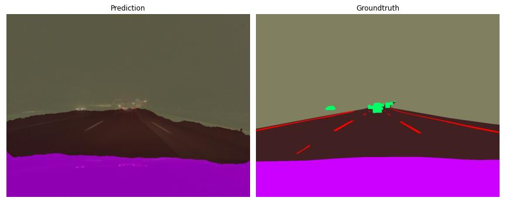
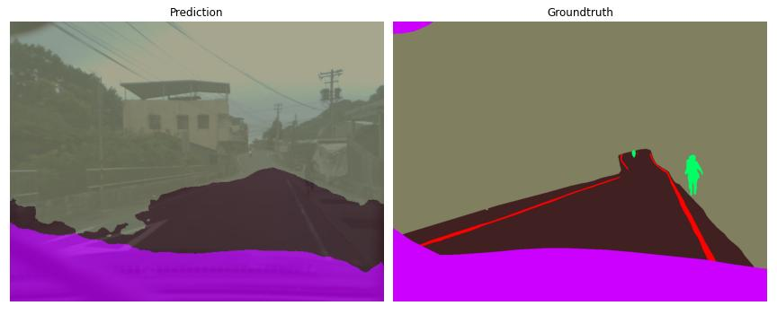
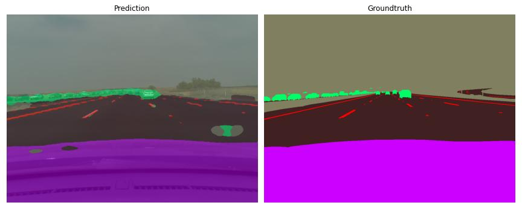

# Comma10k Semantic Segmentation Challenge

Let's tackle comma10k and have some fun.

First I will try to implement the following [paper](https://arxiv.org/pdf/2111.09957v2.pdf) and see how this is going to work out. I have chosen this one because it is small (and hopefully fast) and it has good results on common benchmarks for semantic segmentation like [Cityscapes](https://www.cityscapes-dataset.com/) and [CamVid](https://mi.eng.cam.ac.uk/research/projects/VideoRec/CamVid/).

## TODOs

* mixed precision training
* evaluation (pixel accuracy, IoU, F1 Score)
* more augmentations (including augs makes the results worse, there is a bug somewhere)
* ~~visualization methods~~

## Predictions

Down below you can see a few example predictions of the current model, trained for 50 epochs without any augmentations. Results look pretty good, but something is broken with the mask augmentation in albumentations, working on it.

