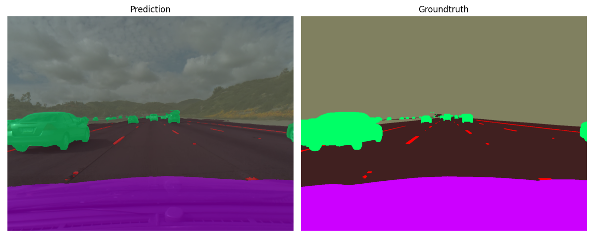

# Comma10k Challenge

Let's tackle the [comma10k](https://github.com/commaai/comma10k) segmentation and have some fun.

First I will try to implement the following [paper](https://arxiv.org/pdf/2111.09957v2.pdf) and see how this is going to work out. I have chosen this one because it is small (and hopefully fast) and it has good results on common benchmarks for semantic segmentation like [Cityscapes](https://www.cityscapes-dataset.com/) and [CamVid](https://mi.eng.cam.ac.uk/research/projects/VideoRec/CamVid/). 

Moreover I will compare it to some of the older approaches like [UNet](https://arxiv.org/abs/1505.04597) or [DeepLabV3](https://arxiv.org/abs/1706.05587) using the [PyTorch Segmentation Models](https://github.com/qubvel/segmentation_models.pytorch) framework.


## Training

If you want to train your own models, please create a virtual environment. I used PyTorch 1.8.1 (torchvision 0.9.1, cuda-toolkit 11.1) which you should install first, before installing everything from `requirements.txt`. The `config.py` contains all hyperparameter settings for the training run, you can change the values if you want to. 

```
python -m venv .env
source .env/bin/activate
pip install torch==1.8.1+cu111 torchvision==0.9.1+cu111 torchaudio==0.8.1 -f https://download.pytorch.org/whl/torch_stable.html
git clone https://github.com/johanngerberding/comma10k-segmentation-pytorch.git
cd comma10k-segmentation-pytorch
pip install -r requirements.txt
python train.py
```

## RegSeg

Down below you can see a few example predictions of the current RegSeg model, trained for 50 epochs without any augmentations. Results look pretty good.

<p align="center">

</p>

<p align="center">

</p>


## DeepLabV3+ 

Here we have two random prediction samples from the DeepLabV3+ model after 20 epochs.

### Predictions

<p align="center">

</p>

<p align="center">

</p>

### Stats

<p align="center">

</p>

<p align="center">

</p>

## TODOs

* ~~mixed precision training~~
* ~~evaluation (pixel accuracy, IoU, F1 Score)~~
* more augmentations
* ~~visualization methods~~
* ~~add plots of training stats~~